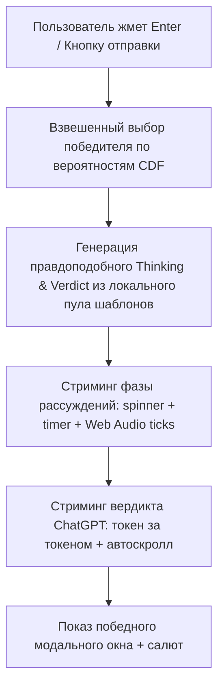

# Спецификация: «LLM-рандомайзер» (LLM Randomizer)

> **Название игры:** LLM-рандомайзер / LLM Randomizer  
> **Формат:** 100% клиентский интерактивный рандомайзер с полной визуальной имитацией интерфейса ChatGPT (OpenAI).  
> **Архитектурный принцип:** **Zero-Backend / Full Simulation**. Никаких внешних API-запросов к сторонним LLM, бэкенда и расхода платных токенов. Приложение полностью автономно работает на стороне браузера (HTML5/CSS3/Vanilla JS), создавая у пользователя 100% ощущение реального взаимодействия с передовой нейросетью.

---

## 1. Концепция и механика игры

1. **Имитация реального чата ChatGPT:**
   - Пользователь настраивает список участников и их вероятности (от 5% до 65%).
   - Запуск раунда происходит прямо из поля ввода чата (по нажатию Enter или кнопки отправки `➤`), как в реальном ChatGPT.
   - В чат автоматически подставляется и отправляется сформированный промпт с актуальным перечнем кандидатов и шансов (поле промпта защищено от ручного редактирования, обновляется автоматически при изменении состава участников).

2. **Двухфазный стриминг ответа нейросети:**
   - **Фаза 1: Блок рассуждений (`Thinking Process` / o1 reasoning):**  
     Отображается процесс «мыслей» модели со спиннером и таймером («Thought for X seconds»). Текст рассуждений пошагово стримится с имитацией анализа энтропии, Монте-Карло симуляций и нормализации шансов.
   - **Фаза 2: Стриминг вердикта:**  
     Стриминг итогового ответа модели с посимвольной печатью токенов, звуковыми тиками и мигающим курсором.

3. **Честный математический выбор победителя:**
   - Победитель определяется алгоритмом взвешенного псевдослучайного выбора (Cumulative Distribution Function / Roulette Wheel Selection) строго с учетом заданных пользователем вероятностей.

---

## 2. Архитектура (Client-Side Only)

### Преимущества подхода:
- **Нулевая стоимость:** Никаких расходов на API токены OpenAI/Anthropic.
- **Мгновенный отклик и надежность:** Нет сетевых задержек, сбоев серверов, лимитов (Rate Limits) или ошибок авторизации.
- **Приватность:** Никакие пользовательские данные и имена не покидают браузер.
- **Оффлайн-готовность:** Игра работает локально без подключения к интернету.

---

## 3. Пользовательский интерфейс и дизайн

### 3.1. Структура страницы
- **Левая колонка (Панель настроек):**
  - Список участников (до 20 человек) с ручным вводом шансов, кнопками `+` / `-` с шагом 5% и валидацией диапазона.
  - Кнопка «Уравнять шансы» для быстрого распределения долей.
  - Хранение участников, вероятностей и состояния блокировки в `localStorage` (общие ключи `shared_*` с другими рандомайзерами).
- **Правая колонка (Эмуляция окна ChatGPT):**
  - **macOS Chrome Bar:** Цветные кнопки управления окном (красная, желтая, зеленая), строка адреса `https://chatgpt.com/c/ai-randomizer`.
  - **ChatGPT Navbar:** Селектор модели (`GPT-5.6 Sol`, `GPT-5.6 Terra`, `GPT-5.6 Luna`, `GPT-5.3 Instant`), индикатор статуса, аватар пользователя.
  - **Область чата фиксированного размера (`590px` / `520px` mobile):** Естественный браузерный скролл сообщений без скачков высоты окна.
  - **Composer (Строка ввода):** Интерактивное поле с динамическим обновлением промпта и кнопкой отправки.

### 3.2. Звуковой движок (Web Audio API)
- `playTokenTick()` — легкий клик при стриминге токенов.
- `playThinkingPulse()` — пульсирующий звук фазы генерации мыслей.
- `playWinner()` — победный аккорд при определении результата.

### 3.3. Локализация (i18n)
Полная поддержка 3 языков (**RU**, **EN**, **EL**). Пул фраз рассуждений и итоговых вердиктов адаптирован под каждый язык.

---

## 4. Контрольный чеклист приемки
- [x] Отсутствуют сетевые запросы к внешним бэкендам и API.
- [x] Окно ChatGPT сохраняет фиксированную высоту и плавно скроллится.
- [x] Запуск раунда выполняется через инпут чата по Enter или клику на стрелку.
- [x] Победитель определяется строго с учетом установленных весов (вероятностей).
- [x] Все тексты, рассуждения и интерфейс переведены на RU, EN, EL.
