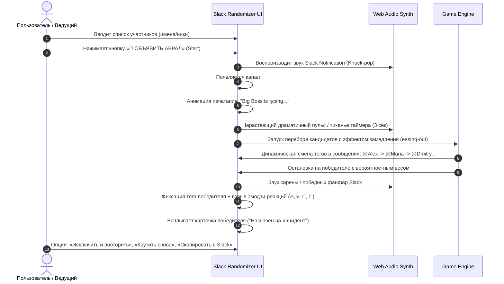

# Спецификация: Рандомайзер «Slack Incident / Кто чинит прод?» (Slack Roulette)

> **Название игры:** Slack Incident Roulette / Кто чинит прод?  
> **Формат:** Интерактивный рандомайзер-игра в стилистике корпоративного Slack-треда с инцидентом.  
> **Цель:** Выбор случайного участника (дежурного, виновника, ведущего дейли, спикера ретро, спасителя прода) через драматичную симуляцию аврала от «Большого Босса».

---

## 1. Ревью продуктовой идеи (Review & Verdict)

### 1.1. Почему идея огонь (Strengths & Viral Factor)
1. **100% попадание в боль и юмор IT/офисной аудитории:** Каждый разработчик, тестировщик, менеджер и DevOps вздрагивает от звука уведомления Slack и сообщений капсом `ПРОД УПАЛ!` или `СРОЧНО В ТРЕД!`.
2. **Драматичный тайминг (3 секунды нарастающего саспенса):** Быстрый перебор `@username` в поле тега с замедлением к финалу создает живую интригу, сравнимую с вращением барабана или рулетки.
3. **Эмоциональный выигрыш (и проигрыш):** Победитель объявляется «Спасителем прода» / «Дежурным героем», тред взрывается анимированными реакциями Slack (🔥, 💀, 🍿, 🚀, 🫡, 💩).
4. **Органичный контекст использования:** Идеально подходит для включения демонстрации экрана в Zoom/Google Meet/Slack Huddle во время утренних дейли, планирований, ретро или назначения дежурств.

### 1.2. Что нужно учесть для максимального эффекта (Key Polish Points)
- **Аудио-триггеры:** Обязателен синтезированный узнаваемый звук "Slack Knock / Pop" на старте и щелчки клавиш/нарастающий тикающий пульс во время выбора.
- **Разнообразие факапов (Алертов):** Босс должен писать случайный смешной текст инцидента из готового пула (база упала, пятничный деплой, клиент на проводе, утечка памяти, ChatGPT перестал отвечать).
- **Мультиязычность:** Полная поддержка локализации (RU, EN, EL) через стандартный `i18n.js` проекта.
- **Поддержка весов участников:** Возможность тонкой настройки вероятностей (как в стандартном шаблоне `randomizer-template.html`).

---

## 2. Пользовательский сценарий (User Journey)



---

## 3. Визуальный дизайн и UI Slack-треда

### 3.1. Общая цветовая палитра Slack (Dark / Light)
- **Фон приложения:** Градиент randomhost (`linear-gradient(135deg, #4A154B 0%, #1A1D21 100%)` — фирменный баклажановый Slack + графитовый).
- **Окно Slack-клиента:** Стилизованное окно приложения:
  - Шапка: Иконка `#`, название канала `#incident-p0-prod-urgent`, статус `🔥 1 P0 ALERT ACTIVE`, бейдж `LIVE`.
  - Левая панель/хедер: Хэштеги каналов, аватарки онлайн.
  - Поле сообщения: Белый/темный блок сообщения в точном стиле Slack (шрифт `Lato`/`-apple-system`, аватарка 36x36 с закруглением 4px, имя автора жирным, время `Только что`, тег `APP` или `BOSS`).

### 3.2. Карточка "Большого Босса"
- **Имя:** `Big Boss` / `CTO on duty` / `Главный Архитектор` (локализовано).
- **Аватар:** Колоритный аватар (стилизованный кот в костюме, строгий мемный босс или горящий сервер).
- **Структура сообщения Босса:**
  ```text
  🚨 @channel КРИТИЧЕСКИЙ ИНЦИДЕНТ #404!
  [Случайный текст факапа: например, "Кто-то накатил миграцию прямо на прод и ушёл на обед!"]
  
  Кто будет фиксить: 👉 @[ПЕРЕБОР_ИМЕН_ТУТ] 👈
  ```

### 3.3. Блок эмодзи-реакций Slack
Под сообщением динамически добавляются и подпрыгивают плашки реакций:
- `🔥 12`
- `💀 7`
- `👀 9`
- `🍿 15`
- `🫡 4`
- `🚀 1`

---

## 4. Алгоритм и Драма-механика (3-секундный тайминг)

1. **Фаза 0: Инициализация (0.0с)**
   - Выбор победителя на основе заданных весов (алгоритм взвешенного выбора `weighted random choice`).
   - Выбор случайного текста инцидента из банка фраз текущей локали.
   - Воспроизведение звука «Knock-Brush / Slack Notification».

2. **Фаза 1: Босс печатает (0.0с – 0.6с)**
   - Появление индикатора `Big Boss is typing...` с тремя прыгающими точками.
   - Текст сообщения появляется с легким эффектом typewriter (печатающаяся строка).

3. **Фаза 2: Драматичный перебор кандидатов (0.6с – 3.6с = ровно 3 секунды)**
   - Текст в блоке выбора переходит в режим рулетки: `@Имя`.
   - **Easing кривая замедления:**
     - 0.6с – 1.8с: Сверхбыстрое мелькание имен (каждые 40–50 мс).
     - 1.8с – 2.6с: Замедление шага (100 мс -> 180 мс -> 280 мс).
     - 2.6с – 3.3с: Напряженные шаги (400 мс -> 600 мс), подсветка тега пульсирует желто-красным цветом.
     - 3.6с: Остановка на выбранном победителе, тег вспыхивает фирменным синим цветом меншена Slack (`background: #1d9bd1; color: #fff;` или `#1164A3`).

4. **Фаза 3: Триумф / Кульминация (3.6с+)**
   - Звук подтверждения / сирены тревоги.
   - Всплывание эмодзи-реакций с анимацией bounce.
   - Конфетти (или летящие эмодзи 🚨, 🔥, 💻, ☕️).
   - Показ модального окна победы со статусом: `«Святой человек найден! @Имя идет спасать прод!»`.

---

## 5. Банк текстов и локализация (i18n)

### 5.1. Русский (RU)
- **Инциденты:**
  1. *«Прод лежит! База данных ушла в бесконечный рекурсивный отпуск!»*
  2. *«Кто задеплоил в пятницу в 18:00?! Платежи не проходят, клиенты звонят директору!»*
  3. *«Память на сервере кончилась, Redis задохнулся, а логи забили весь диск!»*
  4. *«В коде нашли костыль пятилетней давности, и он только что сломался!»*
  5. *«Срочно! Надо провести дейли и назначить виновного на ретро!»*
- **Подпись босса:** *«Спасать прод назначается...»*
- **Победа:** *«Герой определен! @{name}, вся надежда компании на тебя! 🚒»*

### 5.2. Английский (EN)
- **Инциденты:**
  1. *«PROD IS DOWN! The database went on an infinite recursive vacation!»*
  2. *«Who pushed to main on Friday at 6 PM?! Checkout is broken, CEO is on fire!»*
  3. *«OOM killer took down the backend, Redis is dead, disk is 100% full!»*
  4. *«A 5-year-old legacy workaround just exploded in production!»*
  5. *«Emergency standup! We need a hero to lead the incident call!»*
- **Подпись босса:** *«The chosen incident commander is...»*
- **Победа:** *«Incident Commander assigned! @{name}, save our servers! 🚒»*

### 5.3. Греческий (EL)
- **Инциденты:**
  1. *«ΤΟ PROD ΕΠΕΣΕ! Η βάση δεδομένων σταμάτησε να αποκρίνεται!»*
  2. *«Ποιος έκανε deploy την Παρασκευή στις 18:00; Οι πληρωμές κόλλησαν!»*
  3. *«Έκτακτη ανάγκη! Χρειαζόμαστε άμεσα κάποιον να αναλάβει το incident!»*
- **Подпись босса:** *«Ο υπεύθυνος για την επιδιόρθωση είναι...»*
- **Победа:** *«Ο ήρωας βρέθηκε! @{name}, η ομάδα βασίζεται πάνω σου! 🚒»*

---

## 6. Звуковой дизайн (Web Audio API)

В соответствии с правилами `randomhost`, все звуки генерируются процедурно через `AudioContext` (без внешних mp3):
1. **`playSlackNotification()`**: Имитация двухтонального звука уведомления (двойной мягкий щелчок на частотах 800Hz -> 1200Hz с колокольным затуханием).
2. **`playTypingTick()`**: Короткий высокочастотный белый шум / щелчок механической клавиатуры.
3. **`playTensionTone(progress)`**: Нарастающий по частоте синусоидальный тон тревоги от 200Hz до 800Hz.
4. **`playIncidentResolvedFanfare()`**: Мажорный победный аккорд с эмуляцией сирены и фанфар.

---

## 7. Архитектура файлов в `randomhost`

| Файл | Назначение |
|---|---|
| `slack-roulette.html` (или `slack-incident.html`) | Основной автономный файл рандомайзера (HTML + CSS + JS) на базе `randomizer-template.html`. |
| `i18n.js` | Обновление глобального словаря переводов при необходимости. |
| `sound-toggle.js` | Подключение стандартной плавающей кнопки звука. |
| `index.html` | Добавление карточки новой игры в каталог рандомайзеров на главной. |

---

## 8. Критерии приемки (Definition of Done)

- [ ] Игра запускается автономно без внешних зависимостей в любом браузере.
- [ ] Поддерживает ввод от 2 до 100+ участников, ручное удаление, добавление, массовую вставку и веса вероятностей.
- [ ] При нажатии кнопки «Старт» проигрывается сценарий с алертом, набором текста и 3-секундным драматичным перебором тегов.
- [ ] Переключение языков (RU / EN / EL) мгновенно переводит весь интерфейс, включая текст инцидента и реплики босса.
- [ ] Кнопка звука корректно глушит и включает аудиоэффекты.
- [ ] Адаптивный дизайн: безупречно выглядит на мобильных (iPhone/Android) и на широких мониторах при зум-шеринге.
- [ ] Победителя можно удалить из списка одной кнопкой и повторить выбор без перезагрузки страницы.
